# DiddyCart System Architecture

```mermaid
flowchart TB
    subgraph Clients["Client Channels"]
        WEB[Web Browser]
        MOBILE[Mobile App]
        ADMIN[Admin Dashboard]
    end

    subgraph Auth["Security Layer"]
        JWT[JWT Authentication Filter]
        SEC[Spring Security]
    end

    subgraph API["API Gateway / Controllers"]
        AUTH_API[Auth Controller<br/>Login/Register]
        PROD_API[Product Controller<br/>Catalog/Search]
        CART_API[Cart Controller<br/>Add/Remove Items]
        ORDER_API[Order Controller<br/>Place/Track Orders]
        PAY_API[Payment Controller<br/>Process Payments]
        VENDOR_API[Vendor Controller<br/>Vendor Management]
        ADDR_API[Address Controller<br/>Delivery Addresses]
    end

    subgraph Services["Business Logic Layer"]
        AUTH_SVC[AuthService<br/>User Management]
        PROD_SVC[ProductService<br/>Inventory Control]
        CART_SVC[CartService<br/>Cart Operations]
        ORDER_SVC[OrderService<br/>Order Processing]
        PAY_SVC[PaymentService<br/>Payment Handling]
        VENDOR_SVC[VendorService<br/>Vendor Onboarding]
        ADDR_SVC[AddressService<br/>Address CRUD]
        FILE_SVC[FileService<br/>Image Management]
    end

    subgraph Cache["Cache Layer"]
        REDIS[(Redis Cache<br/>---<br/>Products<br/>Cart<br/>Orders<br/>User Profiles<br/>Addresses<br/>Vendors)]
    end

    subgraph Data["Data Persistence Layer"]
        DB[(PostgreSQL<br/>---<br/>Users<br/>Vendors<br/>Products<br/>Categories<br/>Carts<br/>Orders<br/>Payments<br/>Addresses)]
        FS[(File Storage<br/>---<br/>/uploads/<br/>Product Images)]
    end

    subgraph Middleware["Middleware Services (Future)"]
        KAFKA[Apache Kafka<br/>Event Streaming]
        MAIL[Mail Service<br/>Notifications]
    end

    subgraph External["External Integrations"]
        SUPABASE[Supabase PostgreSQL<br/>Cloud Database]
        DOCKER[Docker<br/>Redis Container]
    end

    subgraph Monitoring["Observability"]
        SWAGGER[Swagger UI<br/>API Documentation]
        LOGS[Application Logs<br/>Cache Logging]
    end

    %% Client to Auth
    WEB --> JWT
    MOBILE --> JWT
    ADMIN --> JWT
    
    %% Auth to Controllers
    JWT --> SEC
    SEC --> AUTH_API
    SEC --> PROD_API
    SEC --> CART_API
    SEC --> ORDER_API
    SEC --> PAY_API
    SEC --> VENDOR_API
    SEC --> ADDR_API

    %% Controllers to Services
    AUTH_API --> AUTH_SVC
    PROD_API --> PROD_SVC
    CART_API --> CART_SVC
    ORDER_API --> ORDER_SVC
    PAY_API --> PAY_SVC
    VENDOR_API --> VENDOR_SVC
    ADDR_API --> ADDR_SVC

    %% Services to Cache
    PROD_SVC <-.Cache Hit/Miss.-> REDIS
    CART_SVC <-.Cache Hit/Miss.-> REDIS
    ORDER_SVC <-.Cache Hit/Miss.-> REDIS
    PAY_SVC <-.Cache Hit/Miss.-> REDIS
    AUTH_SVC <-.Cache Hit/Miss.-> REDIS
    VENDOR_SVC <-.Cache Hit/Miss.-> REDIS
    ADDR_SVC <-.Cache Hit/Miss.-> REDIS

    %% Services to Database
    AUTH_SVC --> DB
    PROD_SVC --> DB
    CART_SVC --> DB
    ORDER_SVC --> DB
    PAY_SVC --> DB
    VENDOR_SVC --> DB
    ADDR_SVC --> DB

    %% File Storage
    PROD_SVC <--> FS
    FILE_SVC --> FS

    %% Middleware Connections (Planned)
    ORDER_SVC -.Future.-> KAFKA
    PAY_SVC -.Future.-> KAFKA
    AUTH_SVC -.Future.-> MAIL
    ORDER_SVC -.Future.-> MAIL

    %% External Services
    DB -.Hosted on.-> SUPABASE
    REDIS -.Runs in.-> DOCKER

    %% Monitoring
    API -.Documented in.-> SWAGGER
    Services -.Logs to.-> LOGS
    Cache -.Logs to.-> LOGS

    %% Styling
    classDef clientStyle fill:#81C784,stroke:#388E3C,stroke-width:2px,color:#000
    classDef authStyle fill:#FFB74D,stroke:#F57C00,stroke-width:2px,color:#000
    classDef apiStyle fill:#4FC3F7,stroke:#0288D1,stroke-width:2px,color:#000
    classDef serviceStyle fill:#9575CD,stroke:#5E35B1,stroke-width:2px,color:#fff
    classDef cacheStyle fill:#FF8A65,stroke:#D84315,stroke-width:2px,color:#000
    classDef dataStyle fill:#A1887F,stroke:#5D4037,stroke-width:2px,color:#fff
    classDef middlewareStyle fill:#F06292,stroke:#C2185B,stroke-width:2px,color:#fff
    classDef externalStyle fill:#90A4AE,stroke:#455A64,stroke-width:2px,color:#fff
    classDef monitorStyle fill:#FFF59D,stroke:#F9A825,stroke-width:2px,color:#000

    class WEB,MOBILE,ADMIN clientStyle
    class JWT,SEC authStyle
    class AUTH_API,PROD_API,CART_API,ORDER_API,PAY_API,VENDOR_API,ADDR_API apiStyle
    class AUTH_SVC,PROD_SVC,CART_SVC,ORDER_SVC,PAY_SVC,VENDOR_SVC,ADDR_SVC,FILE_SVC serviceStyle
    class REDIS cacheStyle
    class DB,FS dataStyle
    class KAFKA,MAIL middlewareStyle
    class SUPABASE,DOCKER externalStyle
    class SWAGGER,LOGS monitorStyle
```



## Architecture Layers

### 1. Client Channels
- **Web Browser**: Customer-facing e-commerce interface
- **Mobile App**: Native/hybrid mobile applications
- **Admin Dashboard**: Administrative interface for system management

### 2. Security Layer
- **JWT Authentication Filter**: Intercepts requests, validates Bearer tokens, extracts user ID and role
- **Spring Security**: RBAC enforcement (USER, VENDOR, ADMIN roles)

### 3. API Gateway / Controllers
- **RESTful endpoints** organized by domain (Auth, Product, Cart, Order, Payment, Vendor, Address)
- **Request validation** using Jakarta Bean Validation
- **Response formatting** with standardized DTOs

### 4. Business Logic Layer (Services)
- **AuthService**: User registration, login, profile management
- **ProductService**: Product CRUD, search, pagination, image handling
- **CartService**: Persistent cart operations with stock validation
- **OrderService**: Order placement, status tracking, history
- **PaymentService**: Payment processing simulation, transaction records
- **VendorService**: Vendor onboarding, role escalation, profile management
- **AddressService**: Address book management with ownership validation
- **FileService**: Product image upload/deletion from local storage

### 5. Cache Layer (Redis)
- **Products**: Read-heavy caching by product ID
- **Cart**: Write-through cache with user ID as key
- **Orders**: Composite keys (userId_orderId) for security
- **User Profiles**: Evicted on role changes
- **Addresses**: Composite keys to prevent cross-user access
- **Vendors**: Dual caching (by userId and vendorId)
- **TTL**: 1 hour default, JSON serialization

### 6. Data Persistence Layer
- **PostgreSQL**: Normalized schema (3NF) with JPA/Hibernate
- **File Storage**: Local disk storage at `./uploads/` for product images

### 7. Middleware Services (Planned)
- **Apache Kafka**: Event streaming for order events, payment confirmations (dependencies present but not wired)
- **Mail Service**: Email notifications for registration, orders (dependencies present but not wired)

### 8. External Integrations
- **Supabase**: Cloud-hosted PostgreSQL database
- **Docker**: Redis container via Docker Compose

### 9. Observability
- **Swagger UI**: Interactive API documentation at `/swagger-ui.html`
- **Application Logs**: Console logging for cache events (HIT/MISS/PUT/EVICT)

## Data Flow Examples

### User Registration Flow
```
Web/Mobile → JWT Filter → Auth Controller → Auth Service → PostgreSQL (Users) → Return JWT Token
```

### Add to Cart Flow
```
Web/Mobile → JWT Filter → Cart Controller → Cart Service → Redis (Cache Check) → PostgreSQL (Cart/CartItems) → Redis (Cache Update)
```

### Place Order Flow
```
Web/Mobile → JWT Filter → Order Controller → Order Service → 
  1. Validate Cart (DB)
  2. Verify Address (DB)
  3. Deduct Stock (DB)
  4. Create Order (DB)
  5. Clear Cart (DB + Redis)
  6. Return Order Confirmation
```

### Payment Flow
```
Web/Mobile → JWT Filter → Payment Controller → Payment Service → 
  1. Verify Order (DB)
  2. Create Payment (DB)
  3. Update Order Status (DB)
  4. Evict Order Cache (Redis)
  5. Return Transaction ID
```

## Technology Stack by Layer

| Layer | Technologies |
|-------|-------------|
| Client | Web (React/Vue/Angular), Mobile (React Native/Flutter) |
| Security | Spring Security, JWT (jjwt), BCrypt |
| API | Spring Boot WebMVC, Jakarta Validation |
| Service | Spring Boot, Lombok, Transactions |
| Cache | Spring Cache Abstraction, Redis, JSON Serialization |
| Database | PostgreSQL, Spring Data JPA, Hibernate |
| File Storage | Local Filesystem (UUID-based naming) |
| Middleware | Kafka (planned), Spring Mail (planned) |
| Containerization | Docker, Docker Compose |
| Documentation | SpringDoc OpenAPI, Swagger UI |

## Scalability Considerations

### Current Architecture
- **Stateless API**: JWT-based authentication enables horizontal scaling
- **Cache Layer**: Redis reduces database load for read-heavy operations
- **Connection Pooling**: HikariCP manages DB connections efficiently

### Future Enhancements
- **Load Balancer**: Add NGINX/HAProxy for multi-instance deployment
- **Database Replication**: Master-slave setup for read scaling
- **Object Storage**: Migrate images to S3/Azure Blob Storage
- **Message Queue**: Enable async processing via Kafka
- **CDN**: Serve static assets and images via CDN
- **Service Mesh**: Microservices migration with service discovery
